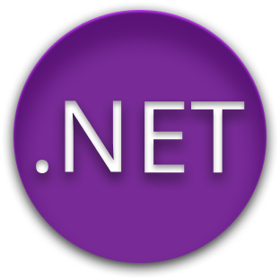
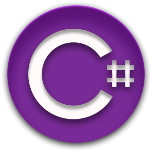
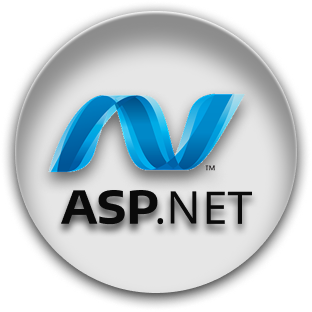
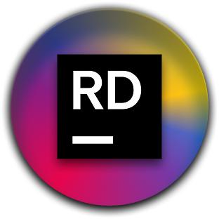
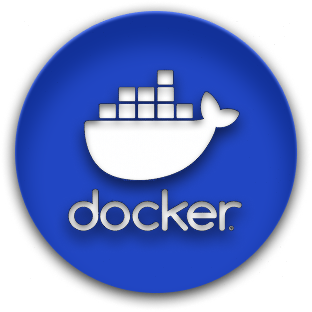

<h1 align="center">William Medeiros</h1>

  Estagiário em Desenvolvimento de Software | Backend .NET

---

## Sobre

Sou estagiário em desenvolvimento de software, com atuação atual em **Mendix (low-code)** e foco de estudos e especialização em **desenvolvimento backend utilizando .NET, C# e ASP.NET**.

Tenho interesse em construção de APIs, regras de negócio, persistência de dados e arquitetura de sistemas, buscando sempre evoluir em boas práticas, organização de código e qualidade de software.

---

## Atuação Atual

- Estagiário em desenvolvimento com **Mendix**
- Participação em projetos com foco em regras de negócio e integração de dados
- Experiência com modelagem e consumo de dados em ambientes corporativos

---

## Tecnologias

<table align="center">
  <tr>
    <td></td>
    <td></td>
    <td></td>
    <td></td>
    <td></td>
    <td></td>
    <td></td>
  </tr>
</table>

---

**Em desenvolvimento**
- APIs REST
- Arquitetura de software
- Docker
- Boas práticas e padrões de projeto

---

## Interesses Técnicos

- Desenvolvimento backend
- Arquitetura de sistemas
- Integrações e APIs
- Desenvolvimento de jogos como estudo de lógica e engenharia de software

---

## Objetivo Profissional

Consolidar minha carreira como **Desenvolvedor Backend .NET**, aplicando conhecimentos técnicos em projetos reais, com foco em soluções escaláveis, bem estruturadas e alinhadas às necessidades do negócio.

---

### 🌐 Contato

---

